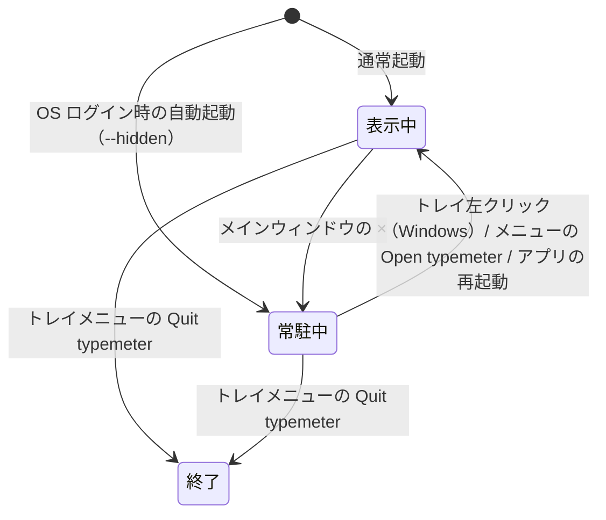

# アプリのライフサイクル

## 概要

このドキュメントでは、typemeter のウィンドウとプロセスのライフサイクル（バックグラウンド常駐）について書いています。具体的には、以下のようなことについて書いています。

- ウィンドウを閉じる操作とプロセス終了の関係（× は終了ではなく常駐になる）
- システムトレイ（macOS ではメニューバー）のメニュー構成と OS ごとの挙動の違い
- 二重起動の防止の仕組み
- 終了時に未保存のキーストローク数が保護される流れ

ただし、以下のような内容は扱っていません。

- アプリケーション設定の保存・同期について（詳しくは、[settings.md](./settings.md) を参照してください）
- アイコン画像の管理について（詳しくは、[app-icon.md](./app-icon.md) を参照してください）
- キーストロークの計測・保存の仕組みそのもの（現在、参照するべきドキュメントはありません）

ウィンドウやトレイの挙動を変更する開発者や、「× で閉じてもプロセスが残る」仕様の全体像を知りたい人が読むことを想定しています。

## ウィンドウとプロセスの関係

typemeter は常駐型アプリであり、すべてのウィンドウの ×（閉じる）は「非表示」を意味し、プロセスの終了はトレイメニューの Quit typemeter からのみ行われます。

各ウィンドウの × の挙動は以下のとおりです（`src-tauri/src/lib.rs` の `CloseRequested` ハンドラで一括制御）。

| ウィンドウ | × の挙動       | 補足                                     |
| ---------- | -------------- | ---------------------------------------- |
| main       | hide（常駐へ） | macOS では Dock アイコンも消える（後述） |
| about      | hide           | 再度開くと同じウィンドウが表示される     |
| settings   | hide           | 同上                                     |

プロセス全体の状態遷移は以下のとおりです。ウィンドウが見えなくても、キーストロークの計測と 1 分ごとの DB 保存は Rust 側のスレッドで動き続けます。

起動時の初期状態は起動経路によって異なります。通常起動ではメインウィンドウを表示しますが、OS ログイン時の自動起動（Settings の「Launch at PC Login」、`--hidden` 引数付きで起動される）では、ウィンドウを表示せず最初から常駐中の状態で開始します（macOS では Dock にも出ません）。

このように、ユーザーから見える「開いている / 閉じている」はウィンドウの表示状態にすぎず、計測プロセスは Quit するまで生き続けます。

## システムトレイ

常駐中の唯一の操作窓口として、Windows は通知領域、macOS はメニューバー右側にトレイアイコンを常時表示します（`lib.rs` の `build_tray()` で構築）。

メニュー構成は OS 共通です。

- Open typemeter — メインウィンドウを表示してフォーカスする
- Settings… — Settings ウィンドウを開く
- Quit typemeter — プロセスを終了する（[終了時のデータ保護](#終了時のデータ保護)を参照）

一方、アイコンとクリック挙動は OS の慣例に合わせて分岐しています（`configure_tray_platform()`）。

| OS      | アイコン                                                                                  | 左クリック             | 右クリック     |
| ------- | ----------------------------------------------------------------------------------------- | ---------------------- | -------------- |
| Windows | アプリアイコンを流用                                                                      | メインウィンドウを表示 | メニューを表示 |
| macOS   | `src-tauri/icons/tray-macos.png`（黒 + 透過のテンプレートイメージ。明暗は OS が自動着色） | メニューを表示         | メニューを表示 |

macOS では、メインウィンドウを閉じて常駐に入る際に activation policy を `Accessory` に切り替えて Dock アイコンと App Switcher から消し、再表示時に `Regular` へ戻します。「普段は存在感を消し、メニューバーのアイコンだけが残る」という常駐アプリの作法に合わせた挙動です。

## 二重起動の防止

typemeter は単一インスタンスで動作し、常駐中にアプリを再度起動する操作は「既存プロセスのメインウィンドウを表示する」操作に変換されます。

常駐中はウィンドウが見えないため、「起動していないと思って再度起動する」操作が起こりやすくなります。これを放置すると計測プロセスが二重になりカウントが重複するため、再起動をウィンドウ表示へ変換します。ユーザーから見ると「アプリを起動したらウィンドウが出てきた」という自然な挙動になります。

この変換の経路は OS によって異なります。

- Windows: 2 個目のプロセスが起動しますが、`tauri-plugin-single-instance` が即座に終了させ、既存プロセスへ通知してメインウィンドウを表示します
- macOS: Finder / Dock からの再起動はそもそも新プロセスにならず、OS が既存プロセスへ reopen イベントを送ります。これを `RunEvent::Reopen` でハンドリングしてメインウィンドウを表示します（ターミナルからバイナリを直接実行した場合のみ、Windows と同じく single-instance 経由になります）

## 終了時のデータ保護

トレイメニューの Quit typemeter は `app.exit(0)` を呼び、終了直前の `RunEvent::Exit` で未保存のキーストローク数が SQLite へ flush されます。

キーストローク数は 1 分ごとに DB へ保存されるため、メモリ上には常に最大 1 分ぶんの未保存カウントが存在します。`RunEvent::Exit` はどの終了経路（トレイの Quit・macOS の Cmd+Q）でも発火するため、この未保存ぶんが失われることはありません。

以上のとおり、終了はトレイからの明示的な操作に限定しつつ、その終了時にもデータロスが起きない設計になっています。
