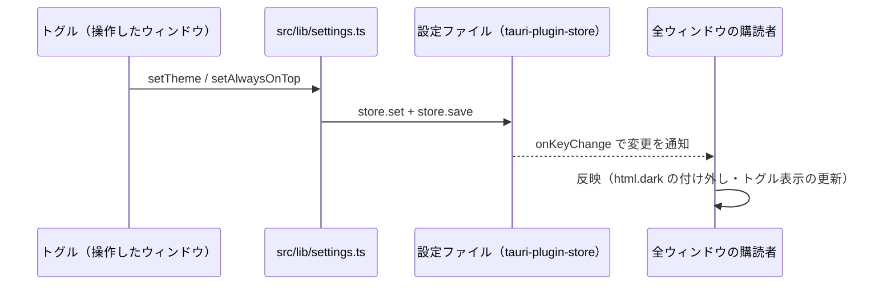
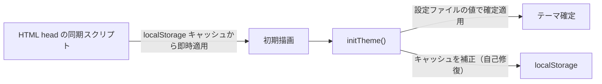

# アプリケーション設定

## 概要

このドキュメントでは、typemeter のアプリケーション設定（ユーザーが変更できる設定）について書いています。具体的には、以下のようなことについて書いています。

- ユーザーが変更できる設定項目と、それを操作する UI 上の場所
- 設定の保存先である `settings.json` と、その保存形式
- 設定の変更時・アプリ起動時に、設定値がどう処理されるか（ウィンドウ間の同期・起動時の復元）
- 設定項目を新しく追加するときの手順

ただし、以下のような内容は扱っていません。

- タイプ数の計測と保存（`keystroke.db`）について（現在、参照するべきドキュメントはありません）
- ウィンドウ（メイン / About / Settings）の生成・表示制御の全般（現在、参照するべきドキュメントはありません）

設定項目を追加・変更する開発者や、設定の保存・同期の仕組みを把握したい人が読むことを想定しています。

## 設定項目一覧

現在の設定項目は「常に最前面に表示」「ライト / ダークテーマ」「ログイン時の自動起動」の 3 つです。

| 設定項目              | 設定場所                                                                  | `settings.json` のキー | 型                  | 未設定時の挙動                           |
| --------------------- | ------------------------------------------------------------------------- | ---------------------- | ------------------- | ---------------------------------------- |
| 常に最前面に表示      | メインウィンドウのヘッダー右側と Settings ウィンドウの「Always on Top」行 | `alwaysOnTop`          | `boolean`           | `false`（最前面に固定しない）            |
| ライト / ダークテーマ | Settings ウィンドウの「Light/Dark Theme」行                               | `theme`                | `"light" \| "dark"` | OS のテーマ設定に追従                    |
| ログイン時の自動起動  | Settings ウィンドウの「Launch at PC Login」行                             | なし（OS 側に保存）    | -                   | 自動起動する（初回起動時に自動で有効化） |

Settings ウィンドウは、以下の場所から開けます。

- macOS: メニューバーの typemeter > Settings…（`Cmd+,`）
- Windows / Linux: カスタムタイトルバーの typemeter > Settings…

このように、設定は Settings ウィンドウに集約しつつ、頻繁に切り替える「常に最前面に表示」だけはメインウィンドウにも直接置かれています（両方のトグルは同期します）。

## 保存先と形式

設定は [tauri-plugin-store](https://v2.tauri.app/plugin/store/) により、アプリデータディレクトリ直下の `settings.json`（以下、設定ファイルという。）に JSON 形式で保存されます。

設定ファイルは、タイプ数を保存する `keystroke.db` と同じディレクトリに置かれます。

| OS      | パス                                                                      |
| ------- | ------------------------------------------------------------------------- |
| Windows | `C:\Users\<ユーザー名>\AppData\Roaming\com.taish.typemeter\settings.json` |
| macOS   | `~/Library/Application Support/com.taish.typemeter/settings.json`         |

設定ファイルの中身は、次のようなフラットな JSON です。

```json
{
  "theme": "dark",
  "alwaysOnTop": true,
  "isAutostartInitialized": true
}
```

各キーは、ユーザーが一度も設定を変更していない間は存在しません。キー不在時の挙動は[設定項目一覧](#設定項目一覧)の表のとおりです。

フロントエンドからの読み書きは `src/lib/settings.ts` に集約されています。スキーマは同ファイルの `SettingsSchema` 型で定義され、キーごとに型付きの getter / setter / 変更購読ヘルパーが export されています。

なお、localStorage にも `theme` キーが保存されますが、これは初期描画のちらつき防止専用のキャッシュであり、真実の源はあくまで設定ファイルです（詳細は[設定の処理フロー](#設定の処理フロー)を参照してください）。

例外として、「ログイン時の自動起動」だけは設定ファイルに保存されません。自動起動の実体は OS 側のエントリ（Windows: レジストリの Run キー、macOS: LaunchAgent）であり、設定ファイルにも持つと二重管理で不整合が起きうるため、[tauri-plugin-autostart](https://v2.tauri.app/plugin/autostart/) を通じて OS 側を唯一の真実の源として直接読み書きします（トグルの表示状態も `isEnabled()` から初期化されます）。

なお、自動起動はデフォルトで有効です。初回起動時に Rust 側（`enable_autostart_on_first_run()`）が一度だけ自動で有効化し、実行済みであることを設定ファイルの `isAutostartInitialized` キーに記録します。このフラグはユーザーが操作する設定値ではなく、「ユーザーが後からオフにした選択を毎回の起動で上書きしない」ための初期化マーカーです。

以上のとおり、「ログイン時の自動起動」を除く設定の実体はアプリデータディレクトリの設定ファイル 1 つであり、フロントエンドは `src/lib/settings.ts` を経由してのみアクセスします。

## 設定の処理フロー

設定は「変更時はストア経由で全ウィンドウに同期され、起動時はウィンドウ表示前・初期描画前に復元される」という 2 つの流れで処理されます。

### 変更時（ウィンドウ間の同期）

どのウィンドウで設定を変更しても、ストアの変更通知（`onKeyChange`）を通じて全ウィンドウに反映されます。なお、「ログイン時の自動起動」はこのフローの対象外で、トグル（`LaunchAtLoginToggle`）がプラグイン API（`enable` / `disable`）で OS 側を直接更新します。



各項目の反映のされ方は以下のとおりです。

- `theme`: 各ウィンドウが `src/lib/theme.ts` の `initTheme()` で変更を購読しており、`<html>` への `dark` クラスの付け外しで切り替えます。Settings ウィンドウのトグル（`ThemeToggle`）もノブの表示位置を同期します
- `alwaysOnTop`: トグル（`AlwaysOnTopToggle`。メインウィンドウと Settings ウィンドウの両方に配置）が、ストアへの保存前にラベル指定で取得したメインウィンドウへ `setAlwaysOnTop()` を直接適用します。保存に失敗した場合はウィンドウ状態・トグル表示とも元の状態にロールバックします。2 つのトグルの表示は `onKeyChange` の購読で互いに同期します

### 起動時（設定の復元）

起動時は、ユーザーに変化が見えないよう「表示より前」に設定を復元します。

- `alwaysOnTop`: Rust 側の setup（`src-tauri/src/lib.rs` の `apply_always_on_top_from_settings()`）が、`window.show()` より前にストアを読んで適用します。これにより「一瞬最前面でない状態で表示されてから固定される」ちらつきを防ぎます
- `theme`: フロントエンドのストア読み込みが非同期であるため、2 段階で適用します



1. 各ウィンドウの HTML（`index.html` / `about.html` / `settings.html`）の `<head>` にある同期インラインスクリプトが、localStorage のキャッシュ（キー `theme`）を読んで `dark` クラスを適用します。これにより初期描画のちらつきを防ぎます
2. `initTheme()` が設定ファイルから値を読んで確定適用し、あわせてキャッシュを補正します。キャッシュが欠損・改変されていても、次回起動までに正しい値へ自己修復されます

まとめると、変更はストアの変更通知で全ウィンドウへ、起動時の復元は `alwaysOnTop` が Rust 側・`theme` がキャッシュ + 確定適用の 2 段階で、それぞれ「ユーザーに切り替えが見えない」ことを優先して処理されます。

## 設定項目を追加する手順

設定項目の追加は、`src/lib/settings.ts` のスキーマとヘルパーを起点に、UI・（必要なら）Rust 側の順に進めます。

1. `src/lib/settings.ts` の `SettingsSchema` にキーと型を追加し、既存項目にならって型付きの getter / setter / 変更購読ヘルパーを実装する
2. UI を配置する。原則として Settings ウィンドウ（`src/settings/App.vue`）に設定行を追加し、常時アクセスが必要な項目に限りメインウィンドウに置く
3. ウィンドウ状態などに作用する設定で起動時の復元が必要な場合は、`src-tauri/src/lib.rs` の setup に適用処理を追加する。ちらつきを防ぐため、`window.show()` より前に適用する
4. 新しい Tauri API の呼び出しが必要な場合は、`src-tauri/capabilities/` 配下の該当ウィンドウの capability に権限を追加する

このように、スキーマ定義（`SettingsSchema`）を唯一の起点とすることで、設定項目が増えても保存・同期の仕組みには手を入れずに済む構造になっています。
